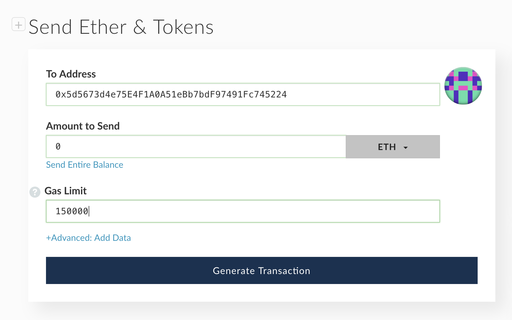

# LONG-TERM INCENTIVE PROGRAM FOR BBO HOLDERS 

## LONG-TERM INCENTIVE PROGRAM, LEAD BY MIDAS FOUNDATION
Midas Foundation is a decentralized autonomous organization founded to empower Midas Pioneers, Midasians and other stakeholders in our ecosystem. Our foundation is essentially a web-based platform for Midasians and Midas Pioneers to invest in frontier technology projects, supporting projects that help a global adoption of many new technologies through assisting startups to raise funds and provide passive income to everyone, is one key pillar of our Midas Ecosystem. On the Midas Foundation, Midasians can invest in ICO, STO, IPO, Startups shares offering, Pooling in Masternode, Token locking for rewards, etc.

The Midas Foundation has been kickstarting potential frontier technology projects, providing reliable information and validating projects according to the Global Transparency Alliance Framework. The Foundation is dedicated to bringing most of the benefits and rewards to Midas Pioneers & Midasians as well as to grow and protect their investments in Midas Ecosystem. 

The ultimate objective of Midas Foundation is to innovate in such a way that it can provide passive income and smart investment opportunities to the Pioneers through rewards/airdrops from those projects that are supported by the Foundation.

As a Vietnam advocate of blockchain technology, we are collaborating with BigBom to offer the “BBO Long-term Incentive” Program for the same above objective.

## SMART CONTRACT
The whole program will be controlled by an Ethereum smart contract. After the activation from Midas Foundation, the program will have a 100% autonomy, thanks to the smart contract code. Midas Foundation and other parties have  the rights to change any of its internal values or the contract logic. The contract address is  

`0x5d5673d4e75E4F1A0A51eBb7bdF97491Fc745224`

OOur contract has been source code certified by etherscan.io, and we expect the community to do an in-depth review. The program is entirely voluntary, and everything follows the code. Participants are aware of the risks of the contract code.

## RULES
1. The long-term incentive program started on **November 29, 2018 - 10:00am (UTC time)**.  
2. The program's participation will be open for 60 days, ending on **January 28, 2019 - 10:00am (UTC time)**. Any tokens deposited after this time will be donated to the Midas Foundation.  
3. The Midas Foundation has already deposited 10 million BBO tokens into the smart contract as a primary reward. With the participation of more benefactors, the number of tokens will increase at any time. The Foundation may choose to deposit any BBO at any time.  
4. **All BBOs transferred to the incentive plan contract through direct transfer will be part of the award and cannot be taken back. If you do not want to contribute BBO for free, please do not directly transfer any BBO to the contract address. Bear in mind that if you really transfer the BBO directly to the incentive plan, we are not able to help you recover your tokens.** You must authorize and confirm the transfer first (instructions below). Please follow each step carefully as the Foundation will not be able to recover your tokens if any mistakes are made.
5. Participants may not withdraw their BBO tokens for 12 months from the date of their original token deposit(s). The token withdraw period will open from the 12th month to 24th month. Participants may withdraw their tokens in partial or in full during this time. Any tokens still remaining in the program after the 24th month will be donated to the Foundation.
6. You can check the timing of your withdrawal on our website at https://bigbomio.github.io/hodl. However, you are solely responsible for tracking the timing of your withdrawal eligibility period as you will not receive any reminders from the Foundation.
7. There are no fees associated with participating in this program.
8. The total number of BBO tokens deposited by investors will not be capped. There are no minimum restriction as well.
 
> The Midas Foundation reserves the right of final decision on the interpretation of the program rules. Please be sure to review this page and its instructions carefully before participating in the program.

## RATE OF RETURNS & BONUS DISTRIBUTION SCHEME
We estimate that 50m of BBO will be deposited into the long-term incentive contract. With 10m of initial reward from Midas Foundation, we can expect the rate of returns as below

### RATE OF RETURNS = TOTAL REWARDS / TOTAL DEPOSITED TOKENS

Using the estimated number, the calculation will be: **10,000,000/50,000,000 = 20% returns**

Another benefit from this program is the rate of return may increase if tokens are held longer than the minimum 12 months holding period. The longer you hold ( up to 24 months), the higher the estimated rate of return.

We also will provide the ability to check the current return via smart contract url at etherscan.io or on our program home page https://bigbomio.github.io/hodl. 

## INSTRUCTIONS TO DEPOSIT BBO

### USING METAMASK

### STEP 1 - Access to web dApp

Using your browser , copy and paste this URL into your browser https://bigbomio.github.io/hodl/#/join 

Please make sure that your browser has Metamask installed (https://metamask.io), and is conecting to **"Main Ethereum Network"** . It won't work if you connect to any other network than Mainnet. If you already logged out, you need to login into Metamask account also.  

After Login, click to **"Connect Metamask"** icon.  

If you're using Metamask version from 5.0.2, and you already enabled "Privacy Mode", you will be asked to authorizes our dApp to connect to your Metamask account. Don't worry, just click **Connect**

### STEP 2 - Making the deposit

If you successful connect to Metamask, you will see the screen with your connected wallet, your current BBO balance, and your deposited tokens into long-term program. For the first time participation, the value of **Current BBO in Holding contract** will always be **0**.  

To participate into the long-term incentive program, just simply put your desired BBO amount into the **Deposit BBO** box below, then click **Deposit**. Please remember that you **MUST** choose a number that less or equal to your current BBO balance. Your Ethereum wallet must have some Ether in order to process the transaction.

You will be asked to make 2 transactions, one transaction for BBO Authorization to BBO Token Smart Contract, and another transaction for actual deposit into long-term incentive contract at `0x5d5673d4e75E4F1A0A51eBb7bdF97491Fc745224`. Click **Confirm** on both transaction, then wait for them to be mined on Ethereum network. Please make sure that both transaction is success by checking it's status on Etherscan

After these transaction has been confirmed by Ethereum network, and successful, please reload the dApp at https://bigbomio.github.io/hodl/#/join. Now you will see your deposited tokens has been recorded into long-term incentive program. **CONGRATS!!!**

### USING MYETHERWALLET

### STEP 1 - Authorizing BBO transfer
The instructions below are for using MyEtherWallet, but you may also use the Ethereum official wallet to authorize the BBO token transfer.

> CAUTION! Follow the instructions carefully and DO NOT send your BBO tokens directly to smart contract or without the authorization.

1. Open your [Myetherwallet](https://www.myetherwallet.com/) and select the **Contract** tab.

2. Put the **bigbomeco.eth** in the **Contract Address** field. 

3. Open a new browser tab and open this URL [BBO Smart Contract ABI](http://api.etherscan.io/api?module=contract&action=getabi&address=0x84f7c44b6fed1080f647e354d552595be2cc602f&format=raw). Copy and paste the code from this page into the **ABI / JSON Interface** field and then click **Access**.  

4. Under **Read / Write Contract**, click the **Select a function** drop-down and select **Approve**.  

5. Copy the contract address `0x5d5673d4e75E4F1A0A51eBb7bdF97491Fc745224` in the **_spender** field.

6. Enter the amount of BBO tokens that you wish to deposit into the **_value** field.
> IMPORTANT ! You **MUST** add the suffix `e18` after the amount of BBO tokens to make it works properly

**EXAMPLE**
If you want to deposit 50,000 BBO into the long-term incentive program, you must enter the number **50000e18** into the **_value** field

7. Access your wallet and then click **Write**.

8. Set the Amount to Send at "0" and the **Gas Limit** at the default value, then click **Generate Transaction**.

9. Click **Yes, I am sure! Make Transaction** to authorize the BBO transfer.  

10. You can confirm the transaction status by checking it on Etherscan.io website, Make sure that the transaction is success.

### STEP 2 (OPTIONAL) - Confirm the authorization
This step is optional. In case you want to make sure that you had authorized the correct number, you can use this step for validate your previous authorization.

1. Visit the [BBO Smart contract page](https://etherscan.io/token/0x84f7c44b6fed1080f647e354d552595be2cc602f#readContract).

2. Sroll down to the **28. allowance**, then put your Ethereum address into the **_owner** field. Next, put the long-term incentive contract address `0x5d5673d4e75E4F1A0A51eBb7bdF97491Fc745224` into the **_spender** field. Then click **Query**.

  Verify that the number is match with your authorized tokens in previous step.

### STEP 3 - Execute the deposit
1. Open your [Myetherwallet](https://www.myetherwallet.com/) and select the **Send Ether & Token** tab.

2. Copy the contract address `0x5d5673d4e75E4F1A0A51eBb7bdF97491Fc745224` into the **Address**. Then set the **Amount** to **"0"**. Make sure that you also set the gas limit at least **150,000**. You must have some Ether in your wallet to pay for the transaction fees (small amount).

Click **Generate Transaction** to initiate the transfer. Then click to **Yes, I am sure! Make Transaction** to finalize the transfer.

3. **CONGRATULATIONS!!!** You BBO deposit is now being made into the long-term incentive program. Please also make sure your transaction is success on Etherscan.io 

## INSTRUCTIONS TO WITHDRAW BBO (AFTER HOLDING PERIOD)

### FULL WITHDRAWAL - MYETHERWALLET

In order to withdraw all of your invested tokens after the holding period (12 months), you simply need to make a transaction with 0 Ether into the contract address `0x5d5673d4e75E4F1A0A51eBb7bdF97491Fc745224`

> Note: Please use at least 150,000 gas limit for the transaction, in order to ensure the transaction will be processed. Also you must have some Ether in your wallet for paying the transaction fee.

### PARTIAL WITHDRAWAL - MYETHERWALLET

In order to withdraw a part of your deposited tokens, you need to send a certain Ether into the smart contract. **YOU WONT LOOSE ANY ETHER!!**. The smart contract will return your tokens based on the following formula where X represents the calculated amount of Ether.

We use the conversion rate at 1 ETH = 10,000,000 BBO. In order to calculate the exact amount of Ether you need to send for withdrawing XXX amount of tokens, please use the for

                          Ether need to send = Partial Amount of deposited tokens / 10,000,000

Let's take an example: You deposited 500,000 BBO into the long-term incentive program. After 12 months, you decide to withdraw 100,000 BBO only. The amount of Ether you need to send would be:  

                                          100,000/10,000,000 = 0.01 ETH
                                          
You will receive back 0.01 ETH + 100,000 BBO + any additional tokens earn through interest

